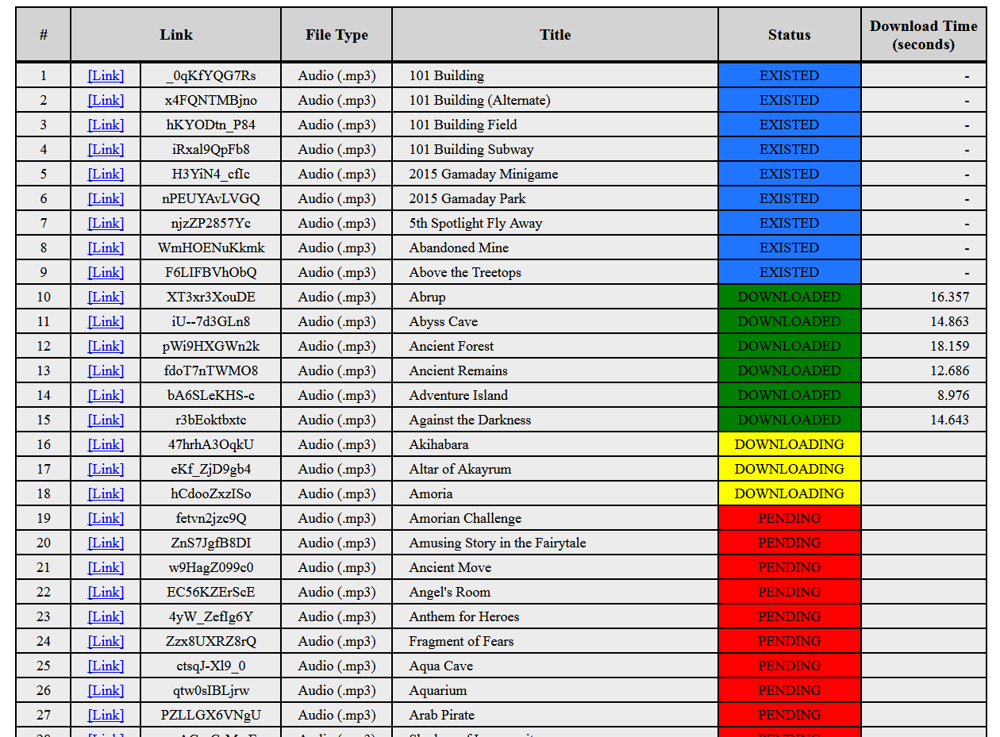
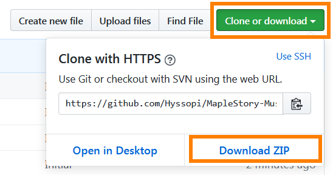

# MapleStory Music YouTube Downloader
Downloads MapleStory music from YouTube to the user's local PC in .mp3 audio format. Retrieves YouTube links from `maplestory-music/maplebgm-db`.

## Prerequisites
- `Node.js` installed

## Build
(None)

## Run
1. Install Node.js

2. Download this repository as a zip file to your local PC. Then extract contents.

    

3. Open command prompt/terminal.

4. Change directory to the main project folder location via `cd`.

5. Run `node main.js`.

6. To view progress: open `progress.html` in web browser.

    

## Test
(None)

## Notes
* This application will not download the file if the file already exists in the given path. If the file is corrupted/incomplete, then delete the file and rerun the application.

* The file is incomplete if you stop the download (for example, the progress is "`DOWNLOADING`") while it is ongoing. You should delete the file before rerunning the application.
